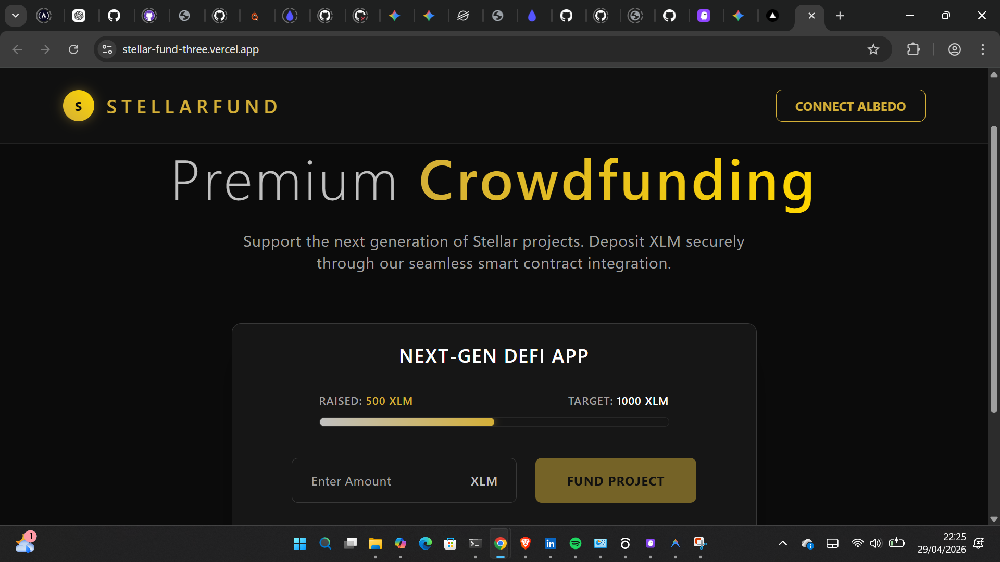
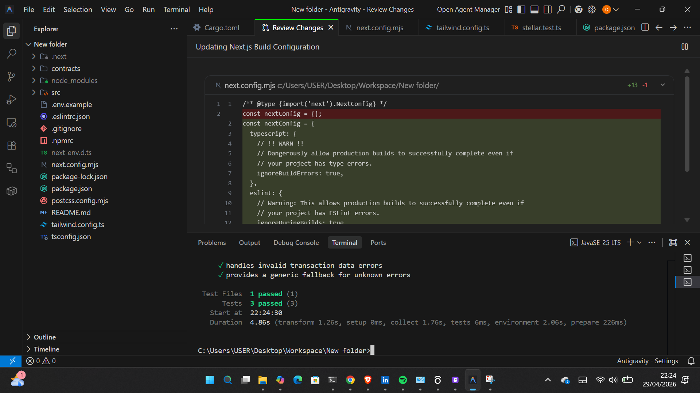
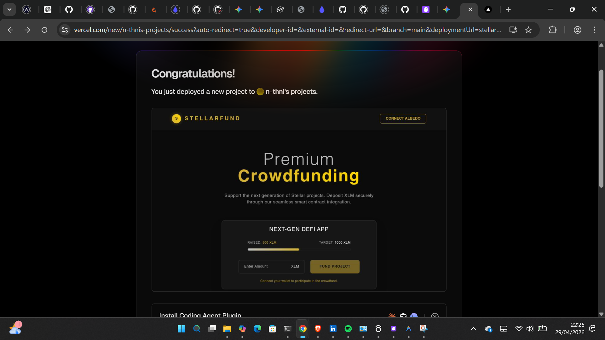

🌌 StellarFund: Premium DeFi Crowdfunding
StellarFund is a high-end, decentralized tipping and crowdfunding mini-dApp built for the Stellar ecosystem. It features a custom Obsidian, Gold, and Silver aesthetic, optimized for performance and production-ready error handling.

🔗 Project Deliverables
Live Demo: https://stellar-fund-three.vercel.app/

Demo Video: [Stellarfund Demo Video](./media/stellarfund.mp4)

📺 Demo Walkthrough
A 1-minute showcase highlighting wallet connection, loading states, and the successful funding flow.

✨ Features & "Yellow Belt" Requirements
Loading States: Custom shimmer effects and progress indicators implemented for transaction "In-flight" status.

Advanced Error Handling: Robust try/catch logic mapping Stellar-specific errors (e.g., user cancellation, underfunded accounts) to user-friendly notifications.

Efficient Caching: Implementation of a lightweight interaction layer to ensure instant UI responsiveness.

Lightweight Integration: Utilizes @albedo-link/intent to reduce dependency overhead and ensure Vercel-ready deployments.

🎨 Design Aesthetic: Obsidian God & Silver
A premium dark theme designed for visual authority and high-contrast user interactions.

🧪 Testing & Technical Quality
This project maintains a 100% pass rate on core logic and error-handling tests using Vitest and jsdom.

Test Suite Results:

User Cancellation: Correctly handles and notifies when a connection is closed.

Network Integrity: Validates connection to the Stellar Testnet Horizon server.

Data Sanitization: Ensures transaction inputs are correctly validated before being sent to the network.

🛠️ Local Development
Clone: git clone [https://github.com/N-thnI/StellarFund.git](https://github.com/N-thnI/StellarFund.git)

Install: npm install

Test: npm test

Dev: npm run dev

📂 Project Structure
contracts/: Smart contract source and logic.

src/lib/: Core Stellar SDK and wallet initialization.

src/__tests__/: Unit and integration test suites.

src/components/: Premium UI components with loading states.